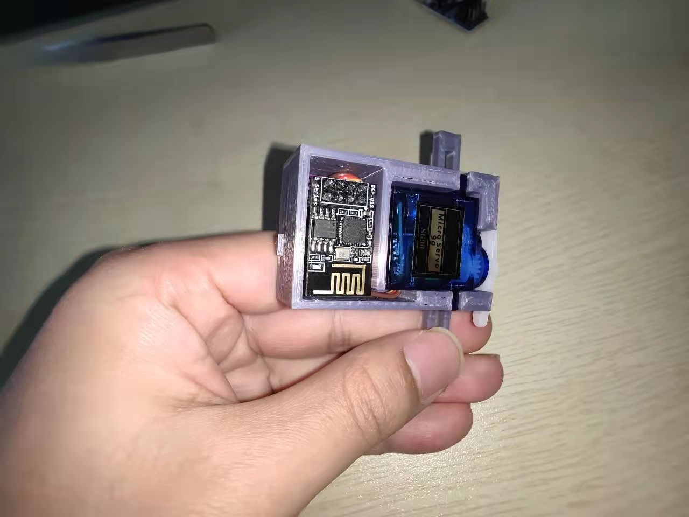
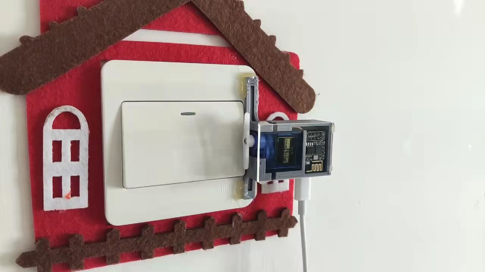
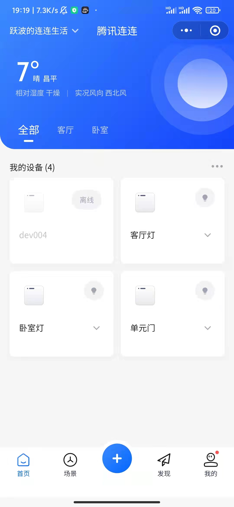
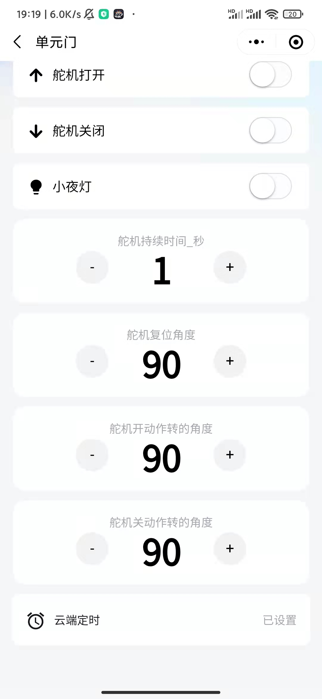
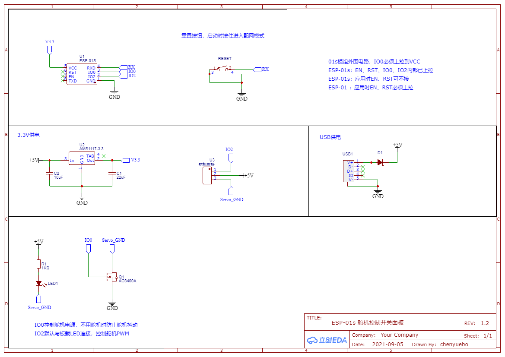
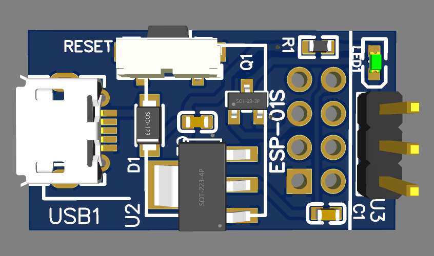

# ESP8266 遥控开关

租住的房屋，在不便拆换原来开关的情况下，使用此开关可以将原开关改造成智能开关，支持手机和智能音箱控制。

本模块可以控制灯，单元门，电脑主机等带有按钮的开关或设备。

8266通过wifi接入了腾讯连连，可以方便的通过手机上腾讯连连微信小程序或者腾讯连连APP进行控制，定时控制。

在腾讯连连上还可以配置按下按钮时，舵机转过的角度，方便适配不同的场景。

本模块同时支持在局域网通过UDP进行控制。

智能音箱控制可以通过云云对接后控制。在没有云云对接的情况下，也可以通过再增加一个红外模块，智能音箱发生红外指令，红外模块发送UDP指令给模块，从而实现智能音箱控制。

本项目是学习Arduino后做的第一个小项目，还有很多需要改进的地方，也不免会有很多错误之处，欢迎大家指正。

原理图是使用立创EDA进行绘制的。PCB是嘉立创打样，手动焊接的。

外壳是使用SolidWorks进行设计的，然后自己3D打印的。

相关文件都已上传。

## 模块效果图

## 模块安装后效果

## 腾讯连连效果图

## 腾讯连连支持配置和定时

## 原理图

## PCB效果图
